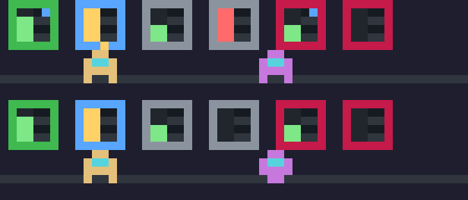
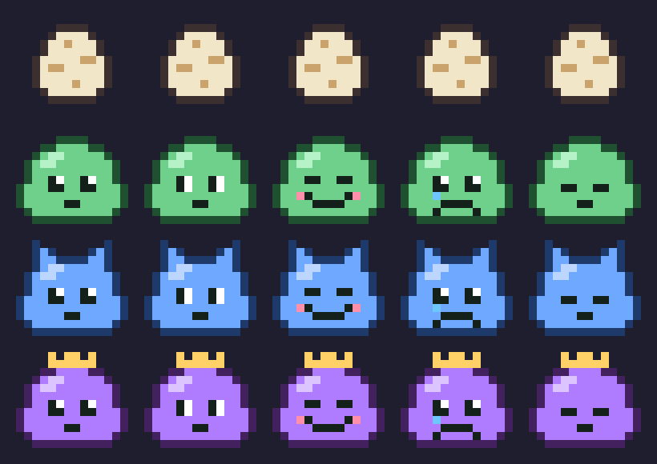

# claude-mods

Mods for Claude Code, in the terminal and in the desktop app's Code tab: little games and toys that live above the prompt, written as plugins of function hooks.



## The mods

### server-farm

An idle game in the band above the prompt. Racks of servers fill up with data, daemon bots walk over to collect it, and you spend it on more racks, more daemons, overclocking and better hardware (Raspberry Pi, Tower, Blade, GPU rig).

Your real work is the weather:

- a turn Claude finishes starts a traffic spike: production x2 for 60 seconds, stacking up to 5 minutes
- passing tests (`npm test`, `vitest`, `pytest` and the like) pay 30 seconds of production
- a failing tool takes a rack down until a daemon fixes it

The farm keeps earning while you are away, at half rate for up to 8 hours. With several sessions open, one runs the farm and the others mirror it and send it their events.

Commands: `/farm` opens the shop (keys `1` to `4` buy), `/farm stats`, `/farm hide`, `/farm show`.

### pixel-pet



A pixel slime that hatches from an egg and grows into a teen and then a slime king as you work. It glances around while Claude works, cheers when tests pass, frowns when a tool fails and falls asleep when you leave.

Commands: `/pet`, `/pet pat`, `/pet name <name>`, `/pet hide`, `/pet show`.

Both mods draw the band above the prompt, so install one at a time.

## Install

```
/plugin marketplace add pierregoutheraud/claude-mods
/plugin install server-farm@pierre-mods
```

## What the mods touch

They watch turns and tool calls (to see whether a call failed or ran tests, never to change it), add their slash command, draw the band above the prompt and keep their save in their own plugin store. No network, no file access, no processes. `claude plugin validate plugins/<name>` lists every hook and call a mod makes.

## Developing

Load a mod straight from this folder; it hot-reloads when you save:

```
claude --plugin-dir plugins/server-farm
```

To load it in every session, the desktop app included, add its absolute path to `CLAUDE_CODE_PLUGIN_DIRS` in the `env` block of your Claude Code `settings.json`. Do not run a dev copy and an installed copy of the same mod at once.

Run the checks before committing (CI runs the same script):

```
./scripts/check.sh
```

It validates the marketplace and each plugin, runs each plugin's tests with `claude plugin test`, and type-checks a plugin once Claude Code has loaded it, which is when its types land in `.claude-plugin/types/` (gitignored).

The function hooks API is early access and can change between Claude Code releases. These mods were built and tested on Claude Code 2.1.287, and CI also runs weekly against the latest release.

## Releasing

Bump `version` in the plugin's `.claude-plugin/plugin.json`, commit, tag and push. Users get it with `/plugin marketplace update pierre-mods`.

## Layout

```
.claude-plugin/marketplace.json   the marketplace: its name and the plugins it lists
plugins/<name>/
  .claude-plugin/plugin.json      the plugin's manifest
  hooks/hooks.json                names the hooks module
  hooks/register.tsx              the hooks: events in, drawing out
  hooks/*.ts                      pure logic and drawing, tested directly
  types/index.d.ts                the plugin's $.state contract
  tests/                          claude plugin test runs these
scripts/check.sh                  validate, test, type-check
```
